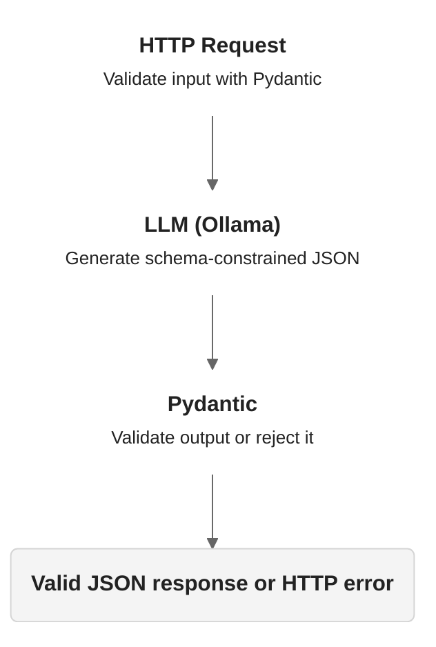

# Goal

Turn an unpredictable LLM into an API with a predictable contract.

```mermaid

%%{init: {"theme": "base", "themeVariables": {"fontFamily": "monospace"}, "flowchart": {"rankSpacing": 55, "htmlLabels": true, "markdownAutoWrap": false, "wrappingWidth": 500}}}%%

flowchart TB
    A["<b>HTTP Request</b><br/><small>Validate input with Pydantic</small>"]
    B["<b>LLM (Ollama)</b><br/><small>Generate schema-constrained JSON</small>"]
    C["<b>Pydantic</b><br/><small>Validate output or reject it</small>"]
    D("<b>Valid JSON response or HTTP error</b>")

    A --> B
    B --> C
    C --> D

    classDef plain fill:transparent,stroke:transparent,color:#222
    classDef result fill:#f4f4f4,stroke:#d5d5d5,color:#222

    class A,B,C plain
    class D result

    linkStyle default stroke:#666,stroke-width:1px

```
